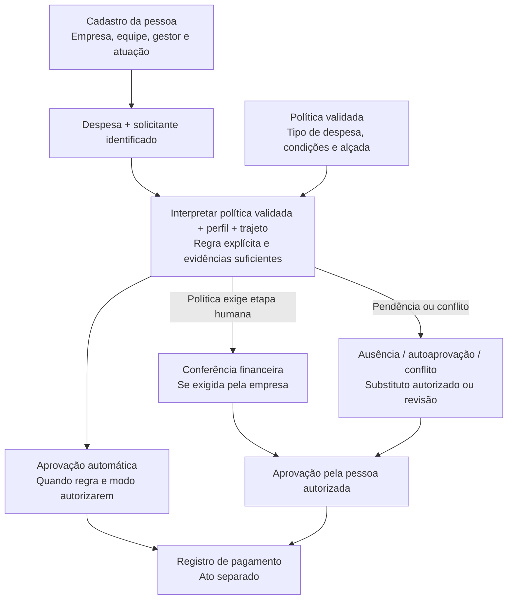

# Revisão da hierarquia — diagnóstico e proposta para a POC

Inspeção estática da main `c5a6bdf`, em 13/09/2026. Nenhuma permissão ou decisão
foi alterada por esta revisão. As conclusões abaixo descrevem o código; o desenho
futuro depende de exemplos e aceite da empresa piloto.

## Conclusão

A implementação representa responsáveis gerais de uma empresa. Ainda não
representa uma hierarquia organizacional com equipes, superior direto, alçadas,
etapas de conferência/aprovação e substituição previamente autorizada.
A entrega [POC-17](entregas/17-hierarquia-alcadas.md) passa a bloquear o aceite do
fluxo de decisão e da POC completa.

## O que existe e a diferença para a operação real

| Tema | Evidência no código | Implicação |
|---|---|---|
| Analista e aprovador | `empresas_config.analistaId/aprovadorId`, [schema](../../db/schema.ts#L557) | Um par de responsáveis para toda a empresa; sem roteamento por equipe, área, tipo ou valor |
| Cargo, papel e grau | `cargo`, `papelFluxo`, `nivelAprovacao`, [schema](../../db/schema.ts#L445) | Grau é armazenado, não é uma alçada monetária; papel/nível aparecem nas tags de identificação, não governam uma cadeia de aprovação |
| Superior direto | Comentário menciona `superiorId`, mas a coluna não está na tabela | Não existe árvore funcional de gestores nem vínculo hierárquico editável |
| Interno/externo | `equipe` existe e assume `externa`, [schema](../../db/schema.ts#L458) | Campo não é novo; falta expor e validar o cadastro. O padrão não comprova a atuação real da pessoa |
| Cadastro operacional | [colaboradorInput e criar](../../api/routers/colaboradores.ts#L20), [tela](../../src/components/equipe/Colaboradores.tsx#L24) | Formulário/API recebem nome, contato, matrícula e centro de custo; não configuram hierarquia, grau ou atuação |
| Fila | [revisao.fila](../../api/routers/revisao.ts#L23) filtra empresa e status | Pessoa autorizada vê a fila empresarial; não há distribuição por gestor/equipe |
| Analista decide | [podeRevisarDespesas](../../contracts/permissoes.ts#L47) e [revisao.decidir](../../api/routers/revisao.ts#L72) | Analista também chega à decisão final; não há etapa obrigatória de conferência anterior ao aprovador |
| Delegação | [exigeMotivoDelegacao](../../contracts/permissoes.ts#L73), registro dentro de decidir | Motivo é registrado depois da autorização geral; não é uma concessão temporária previamente validada |
| Desligamento | [papelRevisaoNaEmpresa](../../api/routers/_shared.ts#L139) não filtra statusVinculo | Se a designação e o acesso persistirem, o desligamento sozinho não retira o poder de decidir; o próprio comentário documenta essa limitação |
| Administração | [assertAdminDaEmpresa](../../api/routers/_shared.ts#L83) reconhece dono criador ou admin global | RH, operador, gestor e administrador da empresa ainda não têm administração contextual completa |
| Solicitante da despesa | [despesas.colaborador](../../db/schema.ts#L193) guarda nome | Falta referência direta e estável do solicitante na despesa para roteamento e prevenção robusta de autoaprovação |

Outra diferença relevante: [revisao.decidir](../../api/routers/revisao.ts#L157)
também atualiza o status dos créditos apurados junto com a despesa. A independência
entre decisão de reembolso e decisão fiscal precisa ser exercitada em POC-08/12;
ela não pode ser presumida apenas pelo desenho de módulos.

## Desenho proposto, a validar

**Diretriz confirmada pelo usuário (D-024):** cargos, responsabilidades e
condições para aprovar automaticamente vêm da política. O sistema deve ler e
estruturar essas regras, validá-las e ligá-las às pessoas reais. O cadastro
resolve quem ocupa a função; não cria uma política paralela de aprovação.

Separar cinco dimensões: acesso ao sistema; função/equipe/gestor; atuação
interna/externa; vínculo contratual; autoridade para cada etapa de uma despesa.
Uma pessoa pode acumular papéis quando a política permitir, sem ganhar acesso
a outras empresas.

Reembolso inelegível recebe o resultado previsto na política com fundamento;
ambiguidade não vira aprovação. Não há valor de teto, número fixo de níveis ou gestor específico presumido.
O caso “vendedor → gestor → financeiro” serve apenas como exemplo a confirmar;
a empresa pode ter outra distribuição e múltiplas condições de aprovação.

## Próximos passos desta frente

1. Descrever três casos reais e responsáveis: gasto do vendedor, do gestor e
   de colaborador interno em atividade externa.
2. Confirmar se análise e aprovação são etapas distintas e se variam por
   valor, categoria, equipe ou centro de custo.
3. Modelar autorização vigente, substituição e conflitos de interesse antes
   de alterar o fluxo existente.
4. Implementar modelo/UI/API em PRs próprios, com testes de acesso, desligamento,
   autoaprovação, ciclos de hierarquia e concorrência.
