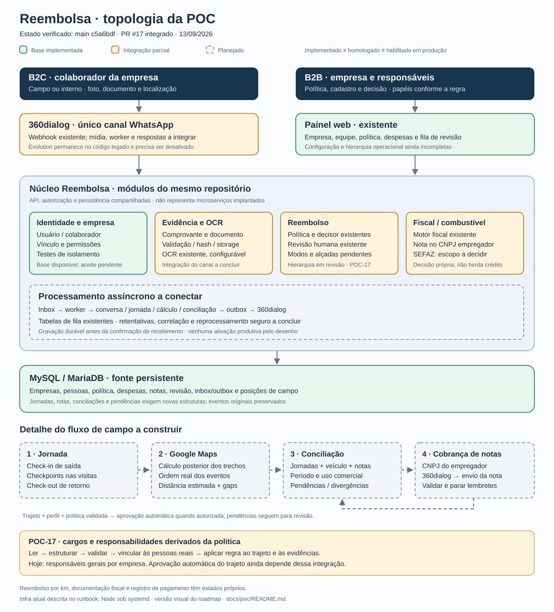
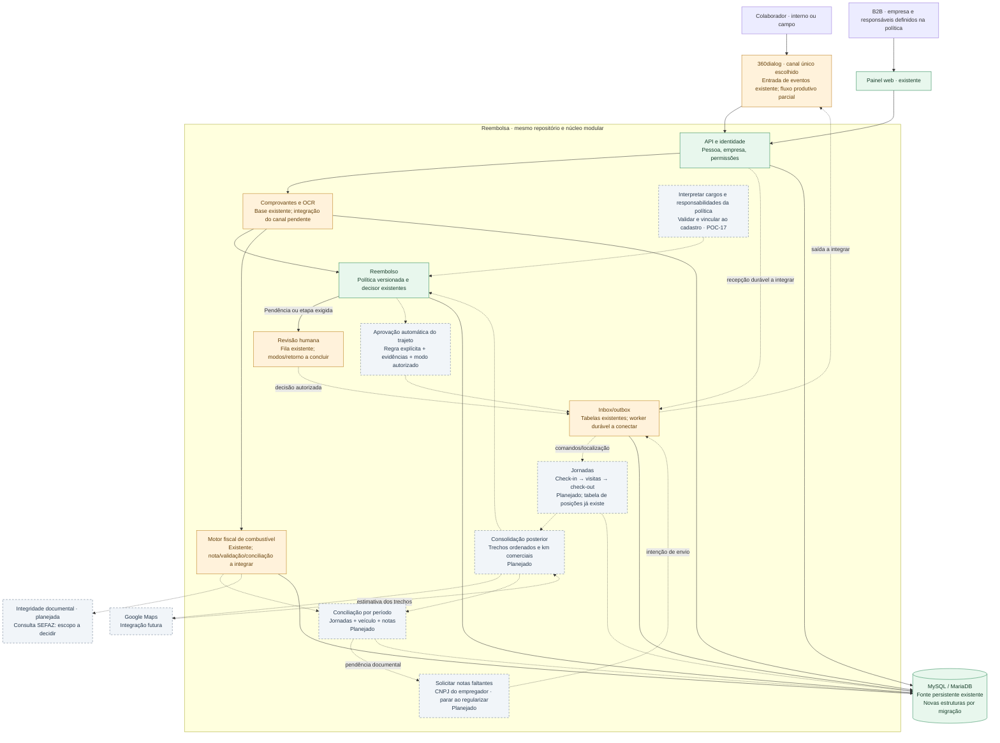

# Topologia da POC — estado atual e desenho de conclusão

Referência: `main` em `c5a6bdf` (PR #17 integrado), verificada em 13/09/2026.
Verde: base implementada. Laranja: integração parcial. Cinza tracejado:
planejado. Implementação não significa homologação ou habilitação produtiva.

## Módulos e conexões

## Como interpretar

- As jornadas [B2B/B2C](GAPS-JORNADAS.md) se encontram no mesmo caso auditável:
  empresa no backoffice, colaborador somente pelo WhatsApp e operação técnica
  com correlação/reprocessamento. Ter cada módulo isolado não fecha a POC.
- Política é fonte de cargos, responsabilidades e autorização de automação
  (D-024). A leitura precisa ser validada e vinculada às pessoas reais. Um
  trajeto elegível pode ser aprovado automaticamente; a [revisão de hierarquia](REVISAO-HIERARQUIA.md)
  mostra por que esse caminho ainda exige trabalho no código atual.
- O deploy atualmente descrito em [DEPLOY](../DEPLOY.md) é Node sob systemd.
  O desenho representa módulos lógicos; não afirma que existam microserviços,
  contêineres de worker ou Google Maps já implantados.
- As tabelas de inbox/outbox existem, porém o webhook 360dialog ainda tem
  persistência best-effort. POC-06 conecta o processamento durável antes de
  habilitar o piloto.
- Reembolso e fiscal consomem evidências com regras próprias. A decisão de um
  motor não autoriza o resultado do outro.
- A posição enviada é um evento; o trajeto entre posições é uma estimativa
  posterior. Eventos originais são preservados. Precisão e horário de captura
  são armazenados somente se fornecidos.
- Conciliação considera várias jornadas e abastecimentos por período. Não
  exige uma nota a cada checkout, nem trata litros abastecidos como consumo
  observado.
- A cobrança de notas usa o CNPJ do empregador identificado no servidor.
  Documentação pendente, reembolso e pagamento registrado têm estados separados.

## Ordem de construção

[POC-01–05 e POC-17](README.md): base, política, modos, cadastro e responsabilidades →
[POC-06–08](README.md): canal e decisão →
[POC-09–10](README.md): campo e Maps →
[POC-11–14](README.md): fiscal, conciliação e cobrança →
[POC-15–16](README.md): medição e aceite completo.
